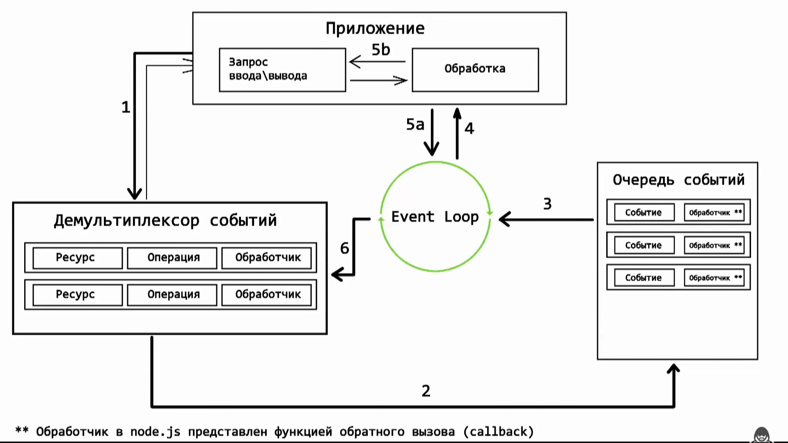

**Node.js** — это среда выполнения JavaScript, построенная на движке V8 от Google Chrome, которая позволяет запускать JavaScript вне браузера, а так же библиотеки **libuv**, отвечающей за кроссплатформенный I/O и цикл событий (event loop). Node.js используется для создания серверных приложений и обладает следующими ключевыми характеристиками:
- **Асинхронная, событийно-ориентированная архитектура**: Node.js использует неблокирующую модель ввода-вывода, что позволяет обрабатывать большое количество одновременных соединений эффективно.
- **Однопоточная модель с поддержкой многозадачности**: Хотя Node.js работает в одном потоке, он может обрабатывать множество операций одновременно благодаря своей асинхронной природе.
- **Модульная система**: Node.js использует систему модулей, что позволяет легко управлять зависимостями и повторно использовать код.
Node.js широко используется для разработки серверных приложений, API, микросервисов и реальных приложений с высокой нагрузкой.

[Ссылка](https://Node.js.org/dist/latest-v18.x/docs/api/) на официальную документацию.

## Основы

### V8

Движок V8 отвечает за интерпретацию JavaScript кода, а так же JIT-компиляцию наиболее часто используемых участков кода, в рамках повышения производительности.
Помимо этого V8 отвечает за работу с памятью и реализацию управления коллстеком в соответствии со спецификацией ECMAScript.

### libuv

Выше уже было указано что данная библиотека отвечает за кроссплатформенный, асинхронный I/O и цикл событий. Этот цикл событий отличается от того, который реализован в браузере, т.к. в нём отсутствуют очереди макро- и микрозадач.
Для реализации цикла событий в Node.js используется архитектурный шаблон Reactor.

---

### Основные компоненты шаблона Reactor

#### Event Demultiplexer

Компонент, который ожидает появления событий ввода-вывода, таких как готовность файловых дескрипторов для чтения или записи, завершение таймеров, сетевые события и т.д.
Когда событие происходит, Event Demultiplexer распределяет его к соответствующему обработчику событий (event handler).

Схема работы демультиплексора 
После того, как приложение сформирует запрос ввода/вывода, происходит следующее:
  1. Запрос передается демультиплексору событий.
    Передача запроса демультиплексору не приводит к блокировке приложения, управление возвращается к приложению (стрелка от демультиплексора к приложению).
  2. Когда асинхронная операция завершается, демультиплексор добавляет соответствующее событие в очередь событий.
  3. Event Loop проверяет очередь и извлекает завершённое событие.
  4. Event Loop передаёт событие в приложение для выполнения обработчика.
  5. 5a - управление возращается к циклу событий. 5b - обработчик создаёт новую асинхронную операцию.
  6. После обработки всех событий из очереди Event Loop блокируется и возвращается к демультиплексору для отслеживания новых асинхронных операций.

#### Event Loop

Цикл, который непрерывно проверяет наличие событий и передает их для обработки соответствующим обработчикам.
Цикл событий (Event Loop) в Node.js — это бесконечный цикл, который непрерывно повторяет определенные фазы для обработки событий. На каждой итерации цикла событий проходят определённые фазы ,которые повторяются пока есть события для обработки.

_Фазы цикла событий_:
  - **Timers**.
В этой фазе обрабатываются коллбэки, зарегистрированные с помощью setTimeout и setInterval.
Когда время истекает, соответствующий коллбэк добавляется в коллстек для выполнения.
  - **Pending Callbacks**.
В этой фазе обрабатываются коллбэки, отложенные до следующей итерации цикла событий.
Например, некоторые системные коллбэки, такие как ошибки TCP.
Когда коллбэк готов к выполнению, он добавляется в коллстек.
  - **Idle, Prepare**.
Внутренние фазы, используемые libuv для подготовки к следующей фазе. Они не имеют прямого отношения к обработке пользовательских событий.
  - **Poll**.
Это основная фаза, где цикл событий проверяет наличие новых событий ввода-вывода и обрабатывает их.
Если нет событий ввода-вывода, эта фаза может блокировать выполнение до появления новых событий.
  - **Check**.
Обрабатывает коллбэки, зарегистрированные с помощью setImmediate.
Когда setImmediate коллбэк готов к выполнению, он добавляется в коллстек.
  - **Close Callbacks**.
Обрабатывает закрывающие коллбэки, такие как socket.on('close').
Когда закрывающий коллбэк готов к выполнению, он добавляется в коллстек.

#### Event Handlers

Обработчики событий, которые выполняются при возникновении событий.
В Node.js это функции-коллбэки, которые передаются в асинхронные операции.
В Node.js коллбэки организованы в списки или очереди по типам событий, и каждый тип списка привязан к соответствующей фазе цикла событий (event loop). На каждой фазе цикла событий (event loop) выполняются все коллбэки, которые готовы к выполнению в этой фазе, до тех пор, пока не истечет определенное время или пока не будут выполнены все коллбэки в очереди. В некоторых случаях, если выполнение коллбэков занимает слишком много времени, цикл событий может ограничить время, проведенное в одной фазе, и перейти к следующей фазе, чтобы избежать блокировки других операций.

---

### npm

При установке Node.js на ПК, вместе с ним так же устанавливается **Node Package Manager (npm)**.
**npm** — это пакетный менеджер для JavaScript, который используется для управления зависимостями в проектах, работающих с Node.js. Он позволяет разработчикам:
- **Устанавливать** и **управлять** библиотеками и фреймворками, которые можно использовать в своих проектах.
- **Публиковать** и **делиться** собственными пакетами с сообществом.
- **Автоматизировать** различные задачи, такие как сборка и тестирование, с помощью скриптов.

Для установки зависимостей в свой проект, необходимо инициализировать проект, т.е. создать начальную структуру и необходимые файлы для разработки.
Инициализация выполняется командой `npm init`, или `npm init -y` чтобы использовать стандартные настройки.
В процессе инициализации создаётся файл _package.json_.
Этот файл содержит метаданные о проекте: имя, версия, автор, лицензия и т.д.
Так же в нём отображается список зависимостей, которые используются в проекте и скрипты, которые можно запускать с помощью npm (например, start, test).

---

### Зависимости

**Зависимости (dependencies)** — это внешние библиотеки, фреймворки, или модули, которые ваш проект использует для выполнения определенных функций или задач. Вместо того чтобы писать весь код с нуля, разработчики могут использовать уже существующие решения, что позволяет сэкономить время и усилия.

#### Типы зависимостей
**Основные зависимости (dependencies)**:
Это библиотеки и модули, которые необходимы для работы вашего приложения в производственной среде.
Они указываются в разделе "dependencies" файла _package.json_.

**Девелоперские зависимости (devDependencies)**:
Это инструменты и библиотеки, которые нужны только в процессе разработки, тестирования и сборки проекта, но не требуются в производственной среде.
Они указываются в разделе "devDependencies" файла _package.json_.

#### Управление зависимостями с помощью npm
**Просмотр установленных зависимостей**:
Для просмотра всех установленных зависимостей используйте команду `npm list`.

**Установка зависимостей**:
- Для установки основной зависимости используйте команду `npm install <package-name>`.
- Для установки разработческой зависимости используйте команду `npm install <package-name> --save-dev`.
- Для установки конкретной версии пакета, используйте команду `npm install <package-name>@<version>`.
Дополнительно можно указать диапазоны версий (подробнее ниже) для обновления, в процессе установки:
- `npm install express@~4.17.1` - будет обновляться в рамках патч версий.
- `npm install express@^4.17.1` - будет обновлятся в рамках минорных и патч версий (используется по умолчанию).
- `npm install express@4.17.1` - установка фиксированной версии, без возможности обновления.
- `npm install express@>=4.17.1 <5.0.0` - возможно обновление в диапазоне от 4.17.1(включительно), до 5.0.0.

При установке любой зависимости в рабочей директории появляется директория **node_modules**, в которой собственно и хранятся используемые зависимости. А так же добавляется файл _package-lock.json_, который фиксирует точные версии всех установленных пакетов, включая вложенные зависимости (зависимости зависимостей).

Папку `node_modules` не включают в репозитории и добавляют в `.gitignore` по следующим причинам:

1. **Большой размер**: экономия места и ускорение операций с репозиторием.
2. **Детерминированность**: файл `package-lock.json` гарантирует одинаковые версии зависимостей.
3. **Кроссплатформенность**: зависимости могут быть платформозависимыми. Поэтому лучше, чтобы каждый разработчик устанавливал зависимости на своей платформе.
4. **Избежание конфликтов**: частые изменения зависимостей могут привести к конфликтам при слиянии веток.
5. **Безопасность**: предотвращение включения потенциально уязвимых файлов.

Т.к. проект скачивается из репозитория без папки `node_modules`, то разворачивание проекта и установка всех необходимых зависимостей выполняется самостоятельно каждым разработчиком:
- `npm install` - устанавливаются _все_ зависимости, указанные в `package.json`;
- `npm install --production` - устанавливаются продакшен зависимости, а зависимости для разработки игнорируются.

**Удаление зависимостей**:
Для удаления зависимости используйте команду `npm uninstall <package-name>`.

**Обновление зависимостей**:
Для обновления _всех_ зависимостей до последних версий используйте команду `npm update`.
Для обновления конкретного пакета в проекте, вы можете использовать команду `npm update <package-name>`.
Вышеуказанные команды выполняют обновление до последней версии в рамках текущего диапазона версий.
Однако, чтобы обновить пакет до последней версии, часто используется команда `npm install <package-name>@latest`.

#### Семантическое версионирование (semver)

Любое обновление зависимостей выполняется согласно диапазону версий, указанному в _package.json_. Этот диапазон версий определяется с помощью семантического версионирования (semver).

Семантическое версионирование использует формат `MAJOR.MINOR.PATCH`, где:

- **MAJOR** (мажорная версия): Вносит несовместимые изменения API.
- **MINOR** (минорная версия): Добавляет новые функции, совместимые с предыдущими версиями.
- **PATCH** (патч-версия): Вносит исправления ошибок, совместимые с предыдущими версиями.

**Диапазоны версий в package.json**

При указании версий в _package.json_ можно использовать различные символы и символические обозначения для определения диапазона версий:

1. **Тильда (`~`)**:
- Обновления только патч-версий.
- Пример: `"express": "~4.17.1"` будет обновлено до `4.17.x`, но не до `4.18.0`.

2. **Каретка (`^`)**:
- Обновления минорных и патч-версий.
- Пример: `"express": "^4.17.1"` будет обновлено до `4.x.x`, но не до `5.0.0`.

3. **Фиксированная версия**:
- Обновления не производятся.
- Пример: `"express": "4.17.1"` будет использовать только версию `4.17.1`.

4. **Диапазоны версий**:
- Можно указать конкретные диапазоны версий.
- Пример: `"express": ">=4.17.1 <5.0.0"`.

Команды `npm update` и `npm install <package-name>@latest` автоматически обновят запись в файле `package.json` с новой версией пакета, если она соответствует указанному диапазону версий.

Можно изменить диапазон версий для уже установленной зависимости, вручную отредактировав файл _package.json_ и затем выполнив команду`npm install`, чтобы применить изменения.

---

### npx

`npx` — это утилита, которая поставляется вместе с npm начиная с версии 5.2.0. Она предназначена для упрощения выполнения пакетов Node.js, которые не установлены глобально на вашем компьютере. Запуск этой утилиты осуществляется следующим образом:
`npx <package-name> <args>`

Например, запуск команды `npx create-react-app my-app` приводит к следующим шагам:

1. **Проверка наличия пакета**:
   - `npx` сначала проверяет наличие пакета в локальной области (в `node_modules` текущего проекта), затем в глобальной области (директории, где npm хранит глобально установленные пакеты).

3. **Загрузка из npm реестра**:
   - Если пакет не найден ни локально, ни глобально, `npx` загружает его из [npm-реестра](https://registry.npmjs.org/) и временно сохраняет для выполнения команды.

4. **Запуск пакета**:
   - `npx` запускает пакет с переданными аргументами.

5. **Создание проекта**:
   - Пакет `create-react-app` создает новую директорию `my-app` с базовой структурой React-приложения, включая установку зависимостей и инициализацию конфигурации.

6. **Удаление временных файлов**:
   - После завершения работы временные файлы, использованные для выполнения команды, удаляются. Если пакет уже был установлен глобально или локально, `npx` использует существующую версию и ничего не удаляет.

`Npx` позволяет запускать не только код, опубликованный в npm. В частности, если у вас есть ссылка на некий фрагмент кода (скажем, опубликованного на GitHub gist), запустить его можно так:

```bash
npx https://gist.github.com/zkat/4bc19503fe9e9309e2bfaa2c58074d32
```

---

### Встроенные модули

Node.js поставляется с обширным набором встроенных модулей, которые предоставляют широкий спектр функциональности для разработки серверных приложений. Эти модули позволяют выполнять различные задачи, такие как работа с файловой системой, создание сетевых серверов и клиентов, управление потоками данных и многое другое.
Описание наиболее часто используемых модулей находится в директории _module-info_ текущего проекта.

---

### Запуск JavaScript кода

Для запуска JavaScript кода, нужном файле с помощью Node.js необходимо сделать следующее:
- перейти в директорию с нужным файлом;
- вызвать команду `node filename.js`;
- либо указать путь до исполняемого файла из текущей директории `node путь/к/файлу`.

Примечание. Не забыть сохранить код в нужном файле, чтобы Node.js запускал актуальный код.

#### Аргументы
При запуске Node.js-скриптов им можно передавать аргументы. Вот обычный вызов скрипта:
```bash
node app.js
```

Передаваемые скрипту аргументы могут представлять собой как самостоятельные значения, так и конструкции вида ключ-значение. В первом случае запуск скрипта выглядит так:
```bash
node app.js flavio
```

Во втором — так:
```bash
node app.js name=flavio
```

От того, какой именно способ передачи аргументов используется, зависит то, как с ними можно будет работать в коде скрипта. Подробнее в директории ./process, в файле README.md.

Полезные _bash_ команды:
- `ls` - проверяет список файлов в текущей директории;
- `cd путь/к/вашей/директории` - перемещает в указанную директорию;
- `node -v` - проверяет наличие Node.js на ПК и её версию.

### REPL

Аббревиатура REPL расшифровывается как Read-Evaluate-Print-Loop (цикл «чтение — вычисление — вывод»). Это среда, которая читает пользовательский ввод, выполняет этот ввод как код и выводит результат операции. В контексте Node.js REPL является интерактивной средой исполнения кода JavaScript, которая позволяет разработчикам быстро тестировать и отладить фрагменты кода в режиме реального времени.Использование REPL — это отличный способ быстрого исследования возможностей Node.js.

Как вы уже знаете, для запуска скриптов в Node.js используется команда node, выглядит это так:

```bash
node script.js
```

Если ввести такую же команду, но не указывать имя файла, Node.js будет запущен в режиме REPL:

```bash
node
```
Node.js теперь находится в режиме ожидания. Система ждёт, что мы введём в командной строке какой-нибудь JavaScript-код, который она будет выполнять. Например:

```javascript
> console.log('test')
test
undefined
>
```
Надо отметить, что REPL распознаёт ввод многострочных выражений и без использования команды `.editor`.

Например, мы начали вводить код итератора:
```javascript
[1, 2, 3].forEach(num => {
...
```
Если, после ввода фигурной скобки, нажать на клавишу Enter, REPL перейдёт на новую строку, приглашение в которой будет выглядеть как три точки.

Режим REPL — полезная возможность Node.js, но область её применения ограничена небольшими экспериментами.

---

### Система импорта и экспорта

Система импорта и экспорта в Node.js основывается на двух основных механизмах: CommonJS и ES Modules (ESM). Оба этих подхода позволяют организовать код в модули, которые могут экспортировать и импортировать функциональность друг из друга, но они делают это по-разному.

#### CommonJS

CommonJS — это стандарт, который первоначально использовался в Node.js для организации кода в модули. В системе CommonJS каждый файл считается модулем, и у него есть свой собственный контекст исполнения. Это означает, что переменные, объявленные в файле-модуле, не становятся глобальными.

**Экспорт** в CommonJS:

```javascript
// myModule.js
const myFunction = () => {
  console.log('Hello, World!');
};

module.exports = myFunction;
```

**Импорт** в CommonJS:

```javascript
// anotherFile.js
const myFunction = require('./myModule');

myFunction(); // Выводит: 'Hello, World!'
```

В CommonJS для экспорта используется объект `module.exports`, а для импорта функция `require()`.

#### ES Modules (ESM)

ES Modules — это стандарт ECMAScript для работы с модулями. Node.js начал поддерживать ESM начиная с версии 12, хотя для полной поддержки требуется указать `"type": "module"` в файле `package.json` или использовать расширение файла `.mjs`.

**Экспорт** в ESM:

```javascript
// myModule.js
export const myFunction = () => {
  console.log('Hello, World!');
};
```

Или экспорт по умолчанию:

```javascript
// myModule.js
const myFunction = () => {
  console.log('Hello, World!');
};

export default myFunction;
```

**Импорт** в ESM:

```javascript
// anotherFile.js
import { myFunction } from './myModule.js';

myFunction(); // Выводит: 'Hello, World!'
```

Или при импорте значения по умолчанию:

```javascript
// anotherFile.js
import myFunction from './myModule.js';

myFunction(); // Выводит: 'Hello, World!'
```

В ESM для экспорта и импорта используются ключевые слова `export` и `import` соответственно.

#### Выбор между CommonJS и ESM

Выбор между CommonJS и ESM зависит от многих факторов, включая личные предпочтения, требования проекта и совместимость с используемыми библиотеками и инструментами. ESM становится все более популярным и является стандартом ECMAScript, но CommonJS по-прежнему широко используется во многих проектах и библиотеках.

---

### Запуск скриптов

Файл `package.json` поддерживает возможность описания команд (скриптов), запускать которые можно с помощью такой конструкции:

```bash
npm <task-name>
```

Например, вот как выглядит перечень скриптов, имеющийся в соответствующем разделе файла:

```json
{
  "scripts": {
    "start-dev": "node lib/server-development",
    "start": "node lib/server-production"
  }
}
```

Весьма распространено использование этой возможности для запуска Webpack:

```json
{
  "scripts": {
    "watch": "webpack --watch --progress --colors --config webpack.conf.js",
    "dev": "webpack --progress --colors --config webpack.conf.js",
    "prod": "NODE_ENV=production webpack -p --config webpack.conf.js"
  }
}
```

Такой подход даёт возможность заменить ввод длинных команд, чреватый ошибками, следующими простыми конструкциями:

```bash
$ npm watch
$ npm dev
$ npm prod
```

---
